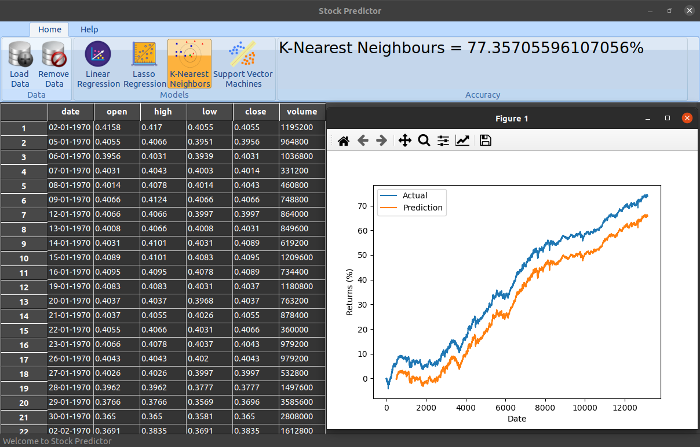

# Stock Predictor
This software is used predict stock prices using various ML models.

# How To Use
* Download the source code
* Install the dependencies
  ```
    sudo apt install python3-wxgtk4.0
    pip install pandas
    pip install sklearn
    pip install seaborn
    pip install matplotlib
    pip install numpy
  ```
* Run
  ```
    python3 main.py
  ```
